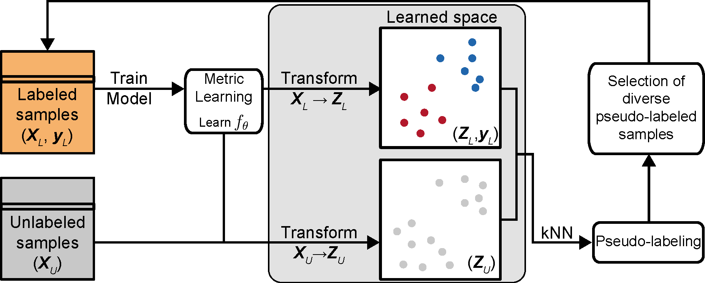

<h1>
  <br>
  <a href="https://github.com/joanagoncalveslab/Metric-DST/archive/refs/heads/public.zip">Metric-DST</a>
</h1> 

<h4 align="center">Mitigating Selection Bias Through Diversity-Guided Semi-Supervised Metric Learning</h4>

<p>
    <a href="https://github.com/joanagoncalveslab/Metric-DST/commits/public/">
    
    <a href="https://github.com/joanagoncalveslab/Metric-DST/issues">
    
    <a href="https://github.com/joanagoncalveslab/Metric-DST/branches">
    
    <a href="https://twitter.com/intent/tweet?text=Try this Metric-DST AutoExec:&url=https%3A%2F%2Fgithub.com%2Fjoanagoncalveslab%2FMetric-DST">
    
    
</p>
      
<p>
  <a href="#abstract">Abstract</a> •
  <a href="#repository-description">Repository Description</a> •
  <a href="#framework">Framework</a> •
  <a href="#installation-and-dependencies">Installation and Dependencies</a> •
  <a href="#dataset-generation">Dataset Generation</a> •
  <a href="#direct-usage-of-metric-dst">Direct Usage of Metric-DST</a> •
  <a href="#code-integration">Code Integration</a> •
  <a href="#bibtext-reference">Bibtext Reference</a> •
  <a href="#license">License</a>
</p>


---

## Abstract

<table>
<tr>
<td>
Selection bias poses a critical challenge for fairness in machine learning, as models trained on data that is less representative of the population might exhibit undesirable behavior for underrepresented profiles. Semi-supervised learning strategies like self-training can mitigate selection bias by incorporating unlabeled data into model training to gain further insight into the distribution of the population. However, conventional self-training seeks to include high-confidence data samples, which may reinforce existing model bias and compromise effectiveness. We propose Metric-DST, a diversity-guided self-training strategy that leverages metric learning and its implicit embedding space to counter confidence-based bias through the inclusion of more diverse samples. Metric-DST learned more robust models in the presence of selection bias for generated and real-world datasets with induced bias, as well as a molecular biology prediction task with intrinsic bias. The Metric-DST learning strategy offers a flexible and widely applicable solution to mitigate selection bias and enhance fairness of machine learning models.

Submitted: <a href="https://doi.org/10.48550/arXiv.2411.18442">Metric-DST</a>.

An earlier preprint appeared in <a href="https://doi.org/10.48550/arXiv.2411.184423">arXiv</a> on 27 Nov 2024.

</td>
</tr>
</table>


## Framework

**Overview of the Metric-DST methodology**. A Metric-DST iteration encompasses 1) training a metric learning model on labeled data that can be used to transform both labeled and unlabeled samples into an embedding space, 2) obtaining predicted pseudo-labels and model confidence values for unlabeled samples using k-nearest neighbors (kNN) on the embedding space representations, 3) selecting diverse pseudo-labeled samples distributed across the learned embedding space and adding them to the labeled set for the subsequent iteration.


## Repository Description

##### Folder hierarchy:
* **data**: Includes all the data for feature generation or experiments.
* **logs**: Log files for each of the experiment and feature generation.
* **results**: json model files and csv experiment performance result files.
* **src**: Includes all the codes for the application.


## Installation and Dependencies

##### Dependencies
* Python3.6 or Python3.7
* Conda

##### Installation
* Open terminal and go to the folder to install the project
* Create environment with dependencies using conda: `conda env create -f metric_env.yml`
* create and activate virtual environment: `conda activate myenv`
  * Detail: https://docs.conda.io/projects/conda/en/latest/user-guide/tasks/manage-environments.html 
* Clone the project: `git clone https://github.com/joanagoncalveslab/Metric-DST.git`
* Enter project: `cd Metric-DST`


## Dataset Generation

##### Load Moon Datasets and apply delta bias
```
from src.andrei import dataset_generator as a_dg
from src.custom import biases as c_bias

#Create a rotated moons dataset with 2000 samples.
dataset_params = {'no_of_samples': 2000}

#50 samples from each class biased towards (0,0) for class 1 and (0,0) for class 2.
bias_params = {'size': 50, 'b': 2, 'delta1': (0,0), 'delta2': (0,0)} 

X, y = a_dg.rotated_moons(**dataset_params)
selected_indices = delta(X, y, **bias_params).astype(int)
X_biased, y_biased = X[selected_indices, :], y[selected_indices]
```

##### Generate synthetic high-dimensional datasets and apply hierarchy bias
```
from src.custom import dataset_generator as c_dg
from src.dbast import bias_techniques as y_bias

#Create 16 dimensional (80% informative) classification dataset with 2000 samples.
#Each class has 2 clusters, and class seperation is 1.5
dataset_params = {'n_samples': 2000, 'n_features': 16, 'r_informative': 0.8, 'n_clusters': 2, 'class_sep':1.5}

#In total, 100 balanced samples are selected using hierarchy bias with 0.9 strength.
bias_params = {'prob': 0.9, 'max_size': 100} 

X, y = c_dg.custom_mdimension(**dataset_params)
selected_indices = bias_by_hierarchyy(X=X, y=y, **bias_params).astype(int)
X_biased, y_biased = X[selected_indices, :], y[selected_indices]
```


##### Load real life datasets and apply hierarchy bias
```
from src.custom import dataset_generator as c_dg
from src.dbast import bias_techniques as y_bias

#Load one of the existing datasets "fire"
dataset_name = 'fire'

#In total, 100 balanced samples are selected using hierarchy bias with 0.9 strength.
bias_params = {'prob': 0.9, 'max_size': 100}

X, y = y_dg.load_dataset(dataset_name, test=False)
selected_indices = bias_by_hierarchyy(X=X, y=y, **bias_params).astype(int)
X_biased, y_biased = X[selected_indices, :], y[selected_indices]
```


## Running Metric-DST

#### Import libraries

```
import pandas as pd

from sklearn.model_selection import train_test_split 
from pytorch_metric_learning import distances, losses, reducers

from network import Network
from divergence import SelfTraining
from metric_learning import MetricLearning
import create_convergence_graph
```

#### Load data and convert to pandas dataframe, split to sets

```
INPUT: X, y
input_shape = X.shape
model_shape = [input_shape[1],8,2]
dataset = pd.DataFrame(X)
dataset['gene1'] = [f'gene1_{gi}' for gi in range(input_shape[0])]
dataset['gene2'] = [f'gene2_{gi}' for gi in range(input_shape[0])]
dataset['class'] = y
dataset_train, dataset_test = train_test_split(dataset, shuffle=True, stratify=dataset_train['class'], test_size=0.2, random_state=124)
dataset_train_labeled, dataset_train_unlabeled = train_test_split(dataset_train, shuffle=True, stratify=dataset_train['class'], test_size=0.7, random_state=124)
dataset_train_labeled_train, dataset_train_labeled_validation = train_test_split(dataset_train_labeled, shuffle=True, stratify=dataset_train_labeled['class'], test_size=0.2, random_state=124)
```

#### Clean commands to run the algorithm (Does not include data process or seed settings or any other details)
```
outputFolder='results'
k_of_knn = 5
confidence_threshold = 0.9
p_sample_to_add = 6
learning_rate=0.01
fold_number=0
device = "cuda" if torch.cuda.is_available() else "cpu"
device = torch.device(device)

distance = distances.LpDistance(normalize_embeddings=False, p=2, power=1)
reducer = reducers.MeanReducer()
loss_func = losses.ContrastiveLoss(pos_margin=0.3, neg_margin=0.5, distance=distance, reducer=reducer)

setup_seed(fold)
ntwrk = Network(model_shape, loss_func, learning_rate, device)
setup_seed(fold)
ml = SelfTraining(ntwrk, dataset_test, dataset_train_labeled_train, dataset_train_unlabeled, dataset_train_labeled_validation, str(outputFolder)+'/', "diversity", k_of_knn, confidence_threshold, p_sample_to_add, model_shape)
ml.train(fold_number, retrain=True, add_samples_to_convergence=True, pseudolabel_method='divergence')
gc.collect()
create_convergence_graph.create_fold_convergence_graph(str(outputFolder / "diversity_performance.csv"), outputFolder)

```

## Reproducing Results in Paper

#### Any experiment except Synthetic Lethality
```shell script
python3 src/custom_pipeline_wholeset.py -rt -esp -m all -b 'hierarchyy_0.9_30.0' -d breast_cancer -np 6

python3 src/custom_pipeline_wholeset.py -rt -esp -m all -b 'hierarchyy_0.9_50.0' -d fire -np 6

python3 src/custom_pipeline_wholeset.py -rt -esp -m all -b 'hierarchyy_0.9_50.0' -d custom_ns2000_nc2_nf128_ri0.8_rs0_fy0_cs1.5 -np 6

python3 src/custom_pipeline_wholeset.py -rt -esp -m all -b 'hierarchyy_0.9_100.0' -d custom_ns2000_nc2_nf16_ri1_rs0_fy0_cs1.5 -np 6

python3 src/custom_pipeline_wholeset.py -rt -esp -m all -b 'delta_50|2|0,0|0,0' -d moon_2000

python3 src/custom_pipeline_wholeset.py -rt -esp -m all -b 'delta_100|2|0,0|0,0' -d moon_2000
```


# Bibtex-Reference
```
@article{Tepeli2023metricdst,
    author = {Tepeli, Yasin I and de Wolf, Mathijs and Gonçalves, Joana P},
    title = {{Metric-DST: Mitigating Selection Bias Through Diversity-Guided Semi-Supervised Metric Learning}},
    journal = {TBD},
    volume = {TBD},
    number = {TBD},
    pages = {TBD},
    year = {2025},
    month = {TBD},
    abstract = {{Selection bias poses a critical challenge for fairness in machine learning (ML), as models trained on less representative samplings of the population might exhibit undesirable behavior for underrepresented profiles. Semi-supervised learning strategies like self-training can mitigate selection bias by incorporating unlabeled data into model training to gain further insight into the data distribution of the underlying population. However, conventional self-training relies on model confidence to decide which unlabeled data to include, which may reinforce existing bias and thus compromise effectiveness. We propose Metric-DST, a diversity-guided self-training strategy that leverages metric learning and its implicit embedding space to counter confidence-based bias by promoting the inclusion of more diverse or dissimilar data samples. Metric-DST learned more robust models in the presence of selection bias for synthetic datasets, as well as 8 real-world benchmark datasets and a challenging molecular biology prediction task. The Metric-DST learning strategy provides a promising flexible solution to mitigate selection bias and enhance the fairness of ML prediction models, applicable to a wide range of domains.}},
    issn = {TBD},
    doi = {TBD},
    url = {TBD}
}
```

## License

[](https://tldrlegal.com/license/gnu-lesser-general-public-license-v3-(lgpl-3))

- Copyright © [ytepeli].
